```mermaid
flowchart LR
    A([Employee Creates Leave Request]) --> B[Submit for Approval]
    B --> C[Workflow: Manager → Program Officer → HR Manager]
    C --> D[All Approvals with Signatures]
    D --> E[Leave Approved]
    E --> F[Update Leave Balance]
    F --> G[Auto-Add to Timesheet]
    G --> H[Employee Completes Timesheet]
    H --> I[Submit Timesheet for Approval]
    I --> J[Workflow: Supervisor → Manager → HR Manager]
    J --> K[All Approvals with Signatures]
    K --> L[Timesheet Approved & Locked]
    L --> M[Generate PDF with Signatures]
    M --> N[Ready for Payroll]
    N --> O([Payroll Processing])
```

# PATH HR System - React Flow Workflow Diagrams

**Document Purpose:** This document provides reference information for the interactive React Flow workflow diagrams implemented in the PATH HR System. These visual diagrams help developers, stakeholders, and users understand the complex approval flows and system interactions.

**Based On:** PATH_COMPREHENSIVE_API_DESIGN.md  
**Implementation:** Interactive React Flow components in `app/workflows/page.tsx` and `components/workflows/`

---

## TABLE OF CONTENTS

1. [Overview](#overview)
2. [React Flow Implementation](#react-flow-implementation)
3. [Leave Request Workflow Diagrams](#leave-request-workflow-diagrams)
4. [Timesheet Approval Workflow Diagrams](#timesheet-approval-workflow-diagrams)
5. [Delegation Flow Diagrams](#delegation-flow-diagrams)
6. [System Architecture Diagrams](#system-architecture-diagrams)
7. [Integration Flow Diagrams](#integration-flow-diagrams)
8. [Component Reference](#component-reference)

---

## OVERVIEW

All workflow diagrams have been implemented as interactive React Flow components. These components are accessible via the `/workflows` route in the Next.js application.

### Accessing the Visualizations

1. **Development:** Navigate to `http://localhost:3000/workflows`
2. **Production:** Navigate to `https://your-domain.com/workflows`

### Features

- **Interactive Navigation:** Sidebar with all available workflows
- **Zoom & Pan:** Mouse wheel to zoom, drag to pan
- **Mini Map:** Bottom-left corner shows overview
- **Controls:** Zoom in/out, fit view, lock/unlock
- **Node Highlighting:** Hover over nodes to see details
- **Edge Animations:** Animated edges show flow direction

---

## REACT FLOW IMPLEMENTATION

### Technology Stack

- **React Flow:** `reactflow` library for interactive flow diagrams
- **Next.js 14+:** App Router with client components
- **TypeScript:** Full type safety
- **Tailwind CSS:** Styling (optional, for page layout)

### Component Structure

```
app/workflows/
└── page.tsx                    # Main visualization page with navigation

components/workflows/
├── LeaveRequest3StepFlow.tsx
├── LeaveRequest1StepFlow.tsx
├── LeaveRequestRejectionFlow.tsx
├── TimesheetApprovalFlow.tsx
├── PeriodLockingFlow.tsx
├── DelegationVacationFlow.tsx
├── AdminDelegationFlow.tsx
├── AuthorityResolutionFlow.tsx
├── LeaveTimesheetIntegrationFlow.tsx
└── EndToEndFlow.tsx
```

### Color Scheme (Implemented)

The workflows use a consistent color scheme:

- **Blue (#e1f5ff):** Start/End nodes (circular, `type: 'input'` or `type: 'output'`)
- **Gray (#f3f4f6):** Draft/Inactive states
- **Yellow (#fef3c7):** Decision points and pending states (`type: 'default'`)
- **Light Blue (#dbeafe):** Process steps
- **Cyan (#d1ecf1):** Information/Integration steps
- **Green (#d4edda):** Approved/Completed states
- **Red (#f8d7da):** Rejected/Declined states
- **Gold (#fff3cd):** Digital signature generation

### Node Types

- **`type: 'input'`:** Start nodes (circular)
- **`type: 'output'`:** End nodes (circular)
- **`type: 'default'`:** Decision/process nodes (diamond/rectangle)
- **No type:** Regular process nodes (rectangle)

---

## LEAVE REQUEST WORKFLOW DIAGRAMS

### Diagram 1: Standard Multi-Level Leave Approval Flow

**Component:** `LeaveRequest3StepFlow.tsx`  
**Route ID:** `leave-3step`  
**Description:** Shows the complete flow of a leave request through 3 approval levels: Manager → Program Officer → HR Manager

**Key Features:**
- Authority checks at each step
- Digital signature generation
- Routing options for adjustments
- Automatic timesheet integration
- Notification triggers

**Node Count:** 25 nodes  
**Edge Count:** 31 edges

**Mermaid Reference (Original Design):**


---

### Diagram 2: Simple Single Approver Flow

**Component:** `LeaveRequest1StepFlow.tsx`  
**Route ID:** `leave-1step`  
**Description:** Simplified workflow with only one approver (Manager)

**Key Features:**
- Single approval step
- Same signature generation
- Simplified flow

**Node Count:** 14 nodes  
**Edge Count:** 16 edges

**Mermaid Reference:**


---

### Diagram 3: Rejection with Routing Choice

**Component:** `LeaveRequestRejectionFlow.tsx`  
**Route ID:** `leave-rejection`  
**Description:** Shows how a rejector can choose where the request goes back to in the workflow

**Key Features:**
- Rejector chooses routing
- Multiple routing options
- Workflow can restart or terminate

**Node Count:** 13 nodes  
**Edge Count:** 16 edges

**Mermaid Reference:**


---

## TIMESHEET APPROVAL WORKFLOW DIAGRAMS

### Diagram 4: Timesheet Approval with Leave Integration

**Component:** `TimesheetApprovalFlow.tsx`  
**Route ID:** `timesheet-approval`  
**Description:** Complete timesheet approval flow showing how approved leaves are automatically integrated

**Key Features:**
- Auto-addition of approved leaves
- Hours verification
- PDF generation with signatures
- Period locking check

**Node Count:** 20 nodes  
**Edge Count:** 25 edges

**Mermaid Reference:**


---

### Diagram 5: Period Locking Flow

**Component:** `PeriodLockingFlow.tsx`  
**Route ID:** `period-locking`  
**Description:** Shows how period locking prevents new submissions

**Node Count:** 18 nodes  
**Edge Count:** 21 edges

**Mermaid Reference:**


---

## DELEGATION FLOW DIAGRAMS

### Diagram 6: Delegation During Vacation

**Component:** `DelegationVacationFlow.tsx`  
**Route ID:** `delegation-vacation`  
**Description:** Shows how delegation works when an approver is unavailable

**Key Features:**
- Delegation authority resolution
- Time-bound validity
- Scope matching
- Delegation context in signatures

**Node Count:** 20 nodes  
**Edge Count:** 28 edges

**Mermaid Reference:**


---

### Diagram 7: System Admin Delegation

**Component:** `AdminDelegationFlow.tsx`  
**Route ID:** `admin-delegation`  
**Description:** Shows how System Admin can delegate on behalf of unavailable users

**Node Count:** 15 nodes  
**Edge Count:** 22 edges

**Mermaid Reference:**


---

## SYSTEM ARCHITECTURE DIAGRAMS

### Diagram 8: Authority Resolution Flow

**Component:** `AuthorityResolutionFlow.tsx`  
**Route ID:** `authority-resolution`  
**Description:** Shows how authority is resolved through multiple layers

**Key Features:**
- Multi-layer checks
- Permission + Scope + Delegation
- Workflow step eligibility

**Node Count:** 15 nodes  
**Edge Count:** 24 edges

**Mermaid Reference:**


---

## INTEGRATION FLOW DIAGRAMS

### Diagram 9: Leave → Timesheet Integration Flow

**Component:** `LeaveTimesheetIntegrationFlow.tsx`  
**Route ID:** `leave-integration`  
**Description:** Shows how approved leaves are automatically added to timesheets

**Node Count:** 20 nodes  
**Edge Count:** 27 edges

**Mermaid Reference:**


---

### Diagram 10: End-to-End Flow

**Component:** `EndToEndFlow.tsx`  
**Route ID:** `end-to-end`  
**Description:** Complete flow from leave request creation to payroll processing

**Node Count:** 15 nodes  
**Edge Count:** 14 edges

**Mermaid Reference:**


---

## COMPONENT REFERENCE

### Implementation Details

Each React Flow component follows this structure:

```typescript
'use client';

import React, { useCallback } from 'react';
import ReactFlow, {
  Node,
  Edge,
  Background,
  Controls,
  MiniMap,
  useNodesState,
  useEdgesState,
  Connection,
  addEdge,
} from 'reactflow';

const nodeTypes = {};

const initialNodes: Node[] = [
  // Node definitions with positions, labels, and styles
];

const initialEdges: Edge[] = [
  // Edge definitions with source, target, labels, and types
];

export default function YourFlowComponent() {
  const [nodes, setNodes, onNodesChange] = useNodesState(initialNodes);
  const [edges, setEdges, onEdgesChange] = useEdgesState(initialEdges);

  const onConnect = useCallback(
    (params: Connection) => setEdges((eds) => addEdge(params, eds)),
    [setEdges]
  );

  return (
    <div style={{ width: '100%', height: '100%' }}>
      <ReactFlow
        nodes={nodes}
        edges={edges}
        onNodesChange={onNodesChange}
        onEdgesChange={onEdgesChange}
        onConnect={onConnect}
        nodeTypes={nodeTypes}
        fitView
      >
        <Background />
        <Controls />
        <MiniMap />
      </ReactFlow>
    </div>
  );
}
```

### Node Styling

Nodes use inline styles with the color scheme:

```typescript
{
  id: 'node-id',
  position: { x: 400, y: 200 },
  data: { label: 'Node Label' },
  style: {
    background: '#d4edda',      // Green for approved
    border: '2px solid #28a745',
    borderRadius: '8px',
    width: 200,
    height: 60,
  },
}
```

### Edge Types

- **`animated: true`** - Animated edges for forward flow
- **`type: 'smoothstep'`** - Curved edges for alternative paths
- **`label: 'Yes'`** - Edge labels for decision outcomes

---

## DIAGRAM SPECIFICATIONS SUMMARY

| Diagram # | Component Name | Route ID | Type | Complexity | Nodes | Edges |
|-----------|----------------|----------|------|------------|-------|-------|
| 1 | LeaveRequest3StepFlow | `leave-3step` | Workflow | High | 25 | 31 |
| 2 | LeaveRequest1StepFlow | `leave-1step` | Workflow | Low | 14 | 16 |
| 3 | LeaveRequestRejectionFlow | `leave-rejection` | Workflow | Medium | 13 | 16 |
| 4 | TimesheetApprovalFlow | `timesheet-approval` | Workflow | High | 20 | 25 |
| 5 | PeriodLockingFlow | `period-locking` | System | Medium | 18 | 21 |
| 6 | DelegationVacationFlow | `delegation-vacation` | Authority | Medium | 20 | 28 |
| 7 | AdminDelegationFlow | `admin-delegation` | Authority | Medium | 15 | 22 |
| 8 | AuthorityResolutionFlow | `authority-resolution` | System | High | 15 | 24 |
| 9 | LeaveTimesheetIntegrationFlow | `leave-integration` | Integration | Medium | 20 | 27 |
| 10 | EndToEndFlow | `end-to-end` | System | High | 15 | 14 |

---

## SETUP INSTRUCTIONS

See `WORKFLOW_VISUALIZATION_SETUP.md` for detailed setup and usage instructions.

### Quick Start

1. Install React Flow:
   ```bash
   npm install reactflow
   ```

2. Start development server:
   ```bash
   npm run dev
   ```

3. Navigate to:
   ```
   http://localhost:3000/workflows
   ```

---

**Document Version:** 2.0  
**Created:** 2025-01-27  
**Updated:** 2025-01-27 (React Flow Implementation)  
**Purpose:** Reference documentation for React Flow workflow visualizations  
**Status:** ✅ Implemented and Ready
